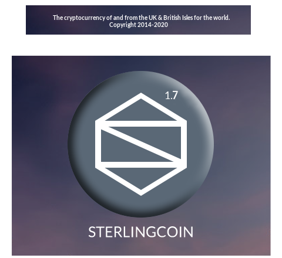

Sterlingcoin Version 1.7.1.2

Sterlingcoin integration/staging tree
================================

http://www.sterlingcoin.org.uk

Copyright (c) 2014 - 2020 Sterlingcoin Developers

What is Sterlingcoin?
The cryptocurrency of and from the UK & British Isles for the world.
----------------
X13
PoW/PoS for 6 Months
PoS after 6 Months
PoS Minimum - 24 Minutes
PoS Maximum - Unlimited
PoS Interest - 5.5% Annually 
30 Blocks for Sterlingcoin to be Minted/Mature
15 Blocks for Sterlingcoin Transaction Confirmation
2 Minute Target Spacing
Difficulty Retargets Every Block
50 Coins Per Block
63,900,000 Total Coins
No Block Halving

P2P Port = 1141
RPC Port = 8311
Testnet Port = 8105

For more information, as well as an immediately useable, binary version of
the Sterlingcoin client sofware, see http://www.sterlingcoin.org.uk

Build Instructions for QT5 Linux Wallet
======================================
Create a folder named Sterlingcoin in /home/ and unpack the contents of ~/Sterlingcoin-master to that folder.

Install dependencies via Terminal:

$ sudo apt-get install make libqt5webkit5-dev libqt5gui5 libqt5core5a libqt5dbus5 qttools5-dev qttools5-dev-tools libprotobuf-dev protobuf-compiler build-essential libboost-dev libboost-all-dev libboost-system-dev libboost-filesystem-dev libboost-program-options-dev libboost-thread-dev libssl-dev libdb++-dev libminiupnpc-dev libevent-dev libcurl4-openssl-dev git libpng-dev qrencode libqrencode-dev

//In terminal navigate to the Sterlingcoin folder.

$ cd /home/Sterlingcoin

//Enter into the terminal:

$ qmake -qt=qt5 "USE_QRCODE=1" "USE_UPNP=-"

//Then:

$ make

This will compile and build the QT Wallet which takes a little while, please be patient.

When finished you will have a file called Sterlingcoin-QT - Simply Double Click

//end of guide

Build Instructions for Terminal Based Linux Wallet
===================================================
//Create a folder named Sterlingcoin in /home/ and unpack the contents of ~/Sterlingcoin-master to that folder.

//Install dependencies via Terminal:

$ sudo apt-get install build-essential libboost-all-dev libcurl4-openssl-dev libdb5.1-dev libdb5.1++-dev qt-sdk make 

//In terminal navigate to the Sterlingcoin folder.

$ cd /home/Sterlingcoin/src/

//Enter into the terminal:

$ make -f makefile.unix "USE_UPNP=-"

//This will produce a file named sterlingcoind which is the command line instance of Sterlingcoin-qt

//Now type:

$ strip sterlingcoind

//When finished you will have a file called sterlingcoind

//To run Sterlingcoin

$ ./sterlingcoind & 

//It will complain about having no sterlingcoin.conf file, we'll edit the one provided and move it into place

$ cd ..
$ nano sterlingcoin.conf

//Edit the Username and Password fields to anything you choose (but remember them) then save the file

$ mv sterlingcoin.conf /home/Sterlingcoin/src/
$ cd src/
$ ./sterlingcoind &

//The server will start. Here are a few commands, google for more.

$ ./sterlingcoind getinfo
$ ./sterlingcoind getmininginfo
$ ./sterlingcoind getnewaddresss

//end of guide

License
-------

Sterlingcoin is released under the terms of the MIT license. See `COPYING` for more
information or see http://opensource.org/licenses/MIT.

Development process
-------------------

Developers work in their own trees, then submit pull requests when they think
their feature or bug fix is ready.

If it is a simple/trivial/non-controversial change, then one of the Sterlingcoin
development team members simply pulls it.

The patch will be accepted if there is broad consensus that it is a good thing.
Developers should expect to rework and resubmit patches if the code doesn't
match the project's coding conventions (see `doc/coding.txt`) or are
controversial.

The `master` branch is regularly built and tested, but is not guaranteed to be
completely stable. [Tags](https://github.com/Sterlingcoin-project/Sterlingcoin) are created
regularly to indicate new official, stable release versions of Sterlingcoin.

Testing
-------

Testing and code review is the bottleneck for development; we get more pull
requests than we can review and test. Please be patient and help out, and
remember this is a security-critical project where any mistake might cost people
lots of money.

### Automated Testing

Developers are strongly encouraged to write unit tests for new code, and to
submit new unit tests for old code.

Unit tests for the core code are in `src/test/`. To compile and run them:

    cd src; make -f makefile.unix test

Unit tests for the GUI code are in `src/qt/test/`. To compile and run them:

    qmake Sterlingcoin_QT_TEST=1 -o Makefile.test Sterlingcoin-qt.pro
    make -f Makefile.test
    ./Sterlingcoin-qt_test
    
//End of ReadMe
